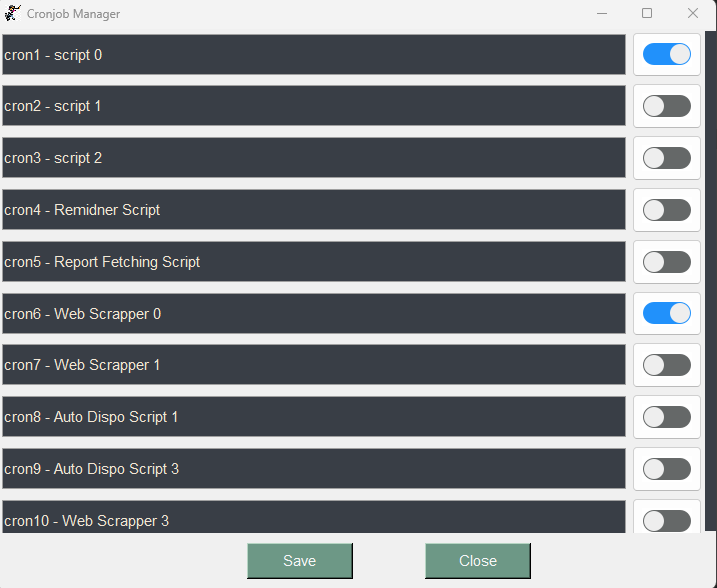

# CrontabGUI
### Python GUI to manage Linux Crontab 
To enable/disable cronjobs running on the linux server at my place of business, I made this small GUI.

You should be able to execute it by running the bash script CronjobManager.sh after setting a few directory 

locations of your own. It essentially works on user account.



## Prerequisites
Install the following before setting up.
- Python >=3.10.8
- pip >=22.2.2

## Setup
- Advise to create virtual environment and set up on venv instead of global.
- You may refer to Python_Virtualenv(https://docs.python.org/3/library/venv.html) to set up virtual env.

- Install the required libraries.
    ```
    pip install requirements.txt
    ```
- Modify your own virtual env and app.py path at CronjobManager.sh.

## Execute
- If you haven't set up any cronjobs, you may still run testing mode to test the user interface by changing the testing value in app.py.

